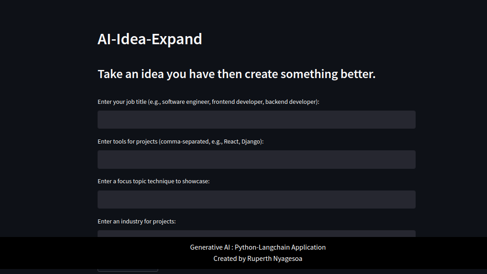

# AI-Idea-Expand

Take an idea you have then create something better.

## About the App

AI-Idea-Expand is powered by the Google Gemini API. It provides tailored project ideas based on your chosen data roles, tools, techniques, and industry.

Feel free to explore and get inspiration for your next data-related project!

## Installation

1. Clone the repository:

   ```bash
   git clone https://github.com/ruperthnyagesoa/AI-Idea-Expand.git
   ```

2. Install the required dependencies:

   ```bash
   pip install -r requirements.txt
   ```

3. Set up your environment variables in a `.env` file:

   ```plaintext
   GOOGLE_API_KEY=your_google_api_key
   ```

4. Run the Streamlit app:

   ```bash
   streamlit run app.py
## UI 
---

